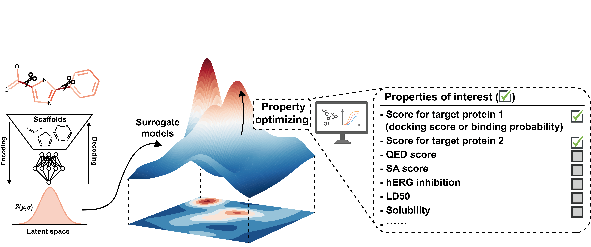

# ScafVAE

### ScafVAE, a framework for scaffold-aware multi-objective drug design.



<details open><summary><b>Table of contents</b></summary>

- [Installation](#installation)
- [Usage](#usage)
  - [Generating moleucules with properties of inerest](#generation)
  - [Train your own model](#training)
- [License](#license)
- [Citation](#citation)
</details>


## Installation <a name="installation"></a>
### Required dependences
ScafVAE is implemented in PyTorch. All basic dependencies are listed in `requirements.txt` 
and most of them can be easily installed with `pip install`. 
We provide tested installation commands in `install_cmd.txt`, for your reference.

### ScafVAE
```pip install -e .```

### Model parameters
Please download the parameters from [here](https://1drv.ms/u/c/469b767efa9cca5a/Edeg5glwvEBKuKVceZ1W-_YBbW2z0vGkxPWRhNsy5d_2IQ?e=ntkjEr) (or [here](http://www.knightofnight.com/upload/data/ScafVAE/ScafVAE.chk)), and put it in the `ScafVAE/params/`.

## Usage <a name="usage"></a>

### Generating moleucules with properties of inerest <a name="generation"></a>

You can use ScafVAE to generate multi-objective molecules by following the notebook `ScafVAE/demo/demo_molecular_design.ipynb`.

The notebook contains:
1. Collecting molecules with their properties.
2. Training surrogate models.
3. Generating multi-objective molecules.

If you want to quickly test the molecular generation, you can simply run the following codes here (or run the `ScafVAE/demo/demo_molecular_design.py`) to generate the dual-target molecules.

```python
from ScafVAE.app.app_utils import *

df_EGFR, df_HER2 = get_demo_properties(max_num=1000, name='binding')  # get molecules with their properties

generation_path = './output'  # path for saving data
tasks = [
  {
    # task name
    'name': 'EGFR_inhibition',

    # input data
    'data': df_EGFR,

    # task type: classification / regression
    'task_type': 'classification',

    # ML model for surrogate model
    'ML_model': 'RF',

    # property is need to be maximized or minimized: max / min
    'optimization_type': 'max',

    # pseudo weight for this property
    'pseudo_weight': 0.5,
  },
  {
    'name': 'HER2_inhibition',
    'data': df_HER2,
    'task_type': 'classification',
    'ML_model': 'RF',
    'optimization_type': 'max',
    'pseudo_weight': 0.5,
  },
]

base_model, surrogate_model = prepare_data_and_train(generation_path, tasks)
df_output = generate_mol(
  10,  # number of generated molecules
  generation_path, tasks, base_model, surrogate_model,
)
print(df_output)  # a dataframe contrains generated molecules with their properties
```


### Train your own model <a name="training"></a>

We provide a pipeline for training the ScafVAE based on user's data in `ScafVAE/demo/demo_molecular_pretraining.ipynb`.

## License <a name="license"></a>
Released under the MIT license.

## Citation <a name="citation"></a>
Under Review


